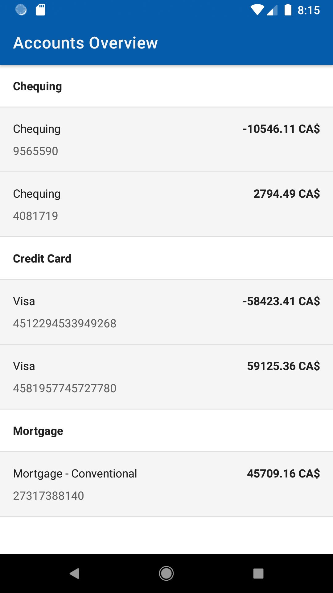
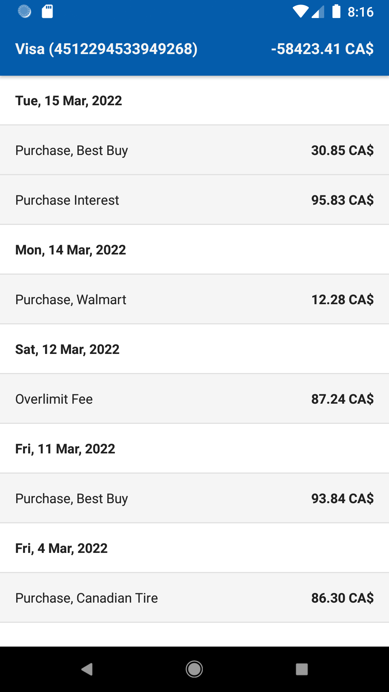
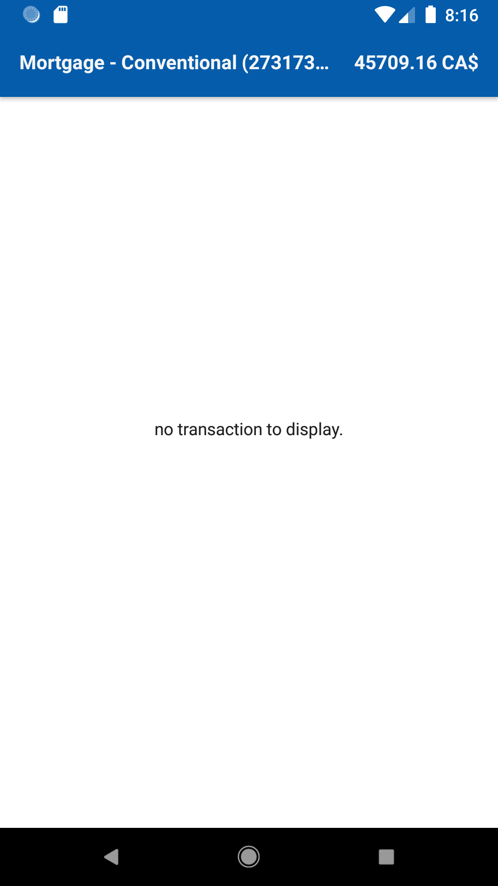

## RBC coding assignment

### Assignment

The objective is to create an Android application to display a list of accounts and their transactions using this mocked library. The
application must:

- display a list of accounts, grouped by account type.
- for each account, display a list of transactions. If the account type is credit card, make an additional call
  to `getAdditionalCreditCardTransactions` api in the library and combine the result with `getAccountTransactions`
- to reduce wait time, the transactions screen should make the api calls in parallel.
- for each transaction, display description and amount.
- transactions screen must display items grouped and sorted by date descending (newest first).

### Grading Criteria and Requirements

- You may choose to use either Kotlin or Java, however please ensure that your submission demonstrates your ability to code in both Java and
  Kotlin.
- Limit 3rd party libraries because we are interested in your abilities with known API and tools. Provide a justification if you feel you
  must leverage technologies that are meant for bigger problems (e.g. Dagger, Databases etc.).
- Adopt best practices when it comes to design patterns, OO concepts, and coding style.
- Design the UI based on what you consider to be visually appealing and usable.
- IMPORTANT! We are looking for the simplest code that can meet the criteria.

### Architecture and Tools

This implementation uses the following tools and libraries:

- Languages: Java, Kotlin
- Jetpack(ViewModel, LiveData), Coroutines and Flow, Dagger, ViewBinding
- Testing: Junit, Turbine, Coroutine Unit Test
- Clean architecture with MVVM, with data, model, and ui layers.

### Testing

Each layer's unit tests can be reached from the following:

- [data](https://github.com/farhad/rbc-assignment/tree/master/app/src/test/java/io/github/farhad/rbc/repository)
- [model (controller)](https://github.com/farhad/rbc-assignment/tree/master/app/src/test/java/io/github/farhad/rbc/controller)
- [viewModels](https://github.com/farhad/rbc-assignment/tree/master/app/src/test/java/io/github/farhad/rbc/viewmodel)
- [data to view state mappers](https://github.com/farhad/rbc-assignment/tree/master/app/src/test/java/io/github/farhad/rbc/mapper)

